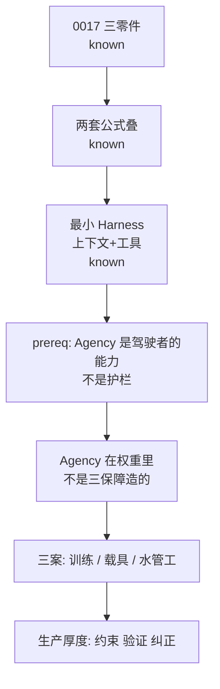

# Session — 0018 Agency vs Harness

Date: 2026-08-31
Model: Cursor Grok
Goal: 过关 0018：谁决策、谁载具；两套公式怎么叠

## Plan

Start: D. Skip reteach of B and C.

## Log
### Node: Agency ≠ 三保障
- taught: Demo 仍有大脑；三保障是载具厚度
- quiz: 「没有审批/门禁的 Demo，Agency 在哪？」→ 选了「没有 Agency」
- result: retry
- retry angle: `label_jobs.py` ① vs ④
- Q5: 仍选「只有④有智能」→ insert prereq

### Node: prereq 驾驶者 vs 护栏
- taught: pending
- quiz: pending
- result:
